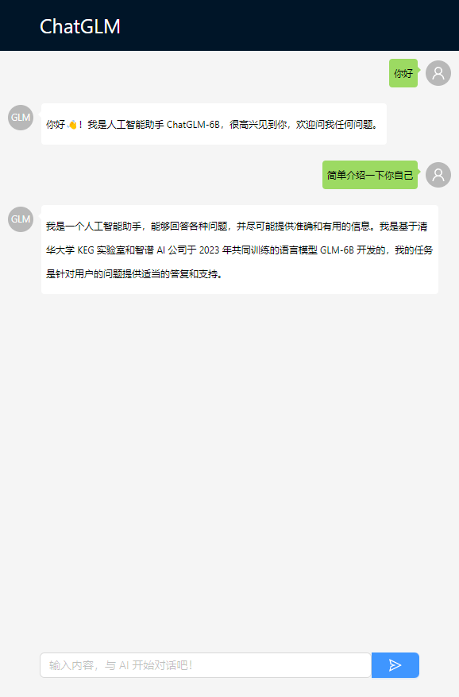

# ReactChatGLM

## 简介

ChatGLM-6B 是一个开源的、支持中英双语的对话语言模型，详情请参见[原代码仓库](https://github.com/THUDM/ChatGLM-6B)。

这是一个基于 React 实现的网页前端，使用了[GoChatGLM](https://github.com/XingKongSync/GoChatGLM)作为后端，支持打字机效果。

## 运行效果

